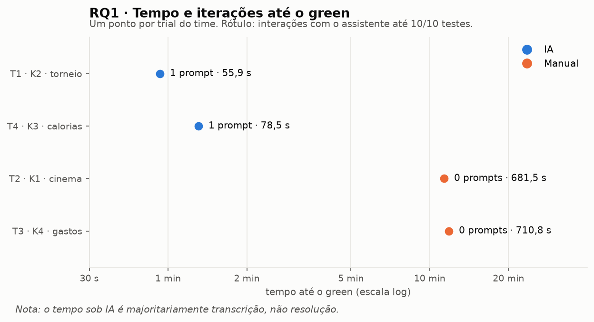
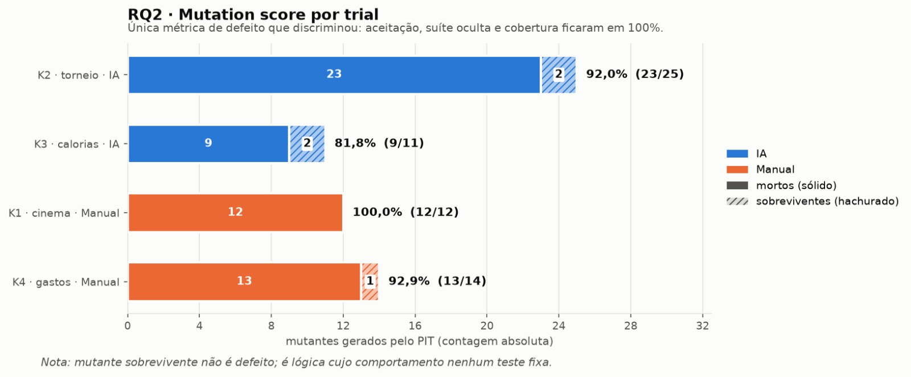
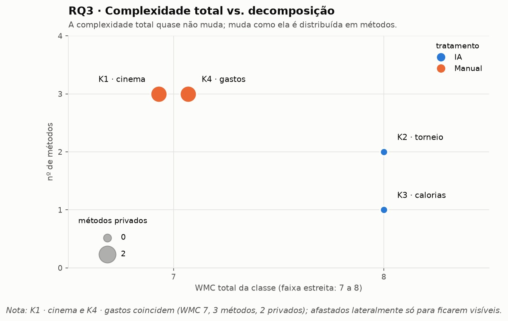

# Relatório Final, Assistentes de IA vs. codificação manual

**Laboratório 02 · Laboratório de Experimentação de Software**
Engenharia de Software · 6º período · Prof. Danilo Maia
Grupo: Bruna Markowisk · Pedro · Thiago Branco

**Repositório:** https://github.com/Brunamark/ia-vs-codificacao-manual

---

## 1. Introdução

Ferramentas de IA generativa tornaram-se onipresentes no desenvolvimento de software, mas a
maior parte da evidência sobre seu impacto é anedótica. Este laboratório conduziu um
**experimento controlado** para avaliar quantitativamente os efeitos do uso de um assistente de
IA na resolução de tarefas de programação, comparando-o à codificação manual.

O experimento usou **4 katas autorais em Java**, escritos pelo grupo e inéditos, resolvidos sob
desenho **crossover within-subject** com time-box de **35 minutos por trial**.

---

## 2. Objetivo, questões de pesquisa e hipóteses

### 2.1 Árvore GQM

| Objetivo Geral | RQ | Métricas |
|---|---|---|
| Analisar o uso de assistentes de IA generativa na resolução de tarefas de programação, com o propósito de caracterizar seus efeitos sobre o processo de resolução, a correção funcional e a estrutura do código produzido, do ponto de vista de pesquisadores em engenharia de software, no contexto de um experimento controlado com 4 katas autorais em Java e time-box de 35 minutos | **RQ1:** O assistente de IA produz uma solução aprovada em todos os testes de aceitação já na primeira iteração? | `prompts`, iterações com o assistente até o green |
| | **RQ2:** O uso de assistente de IA reduz a quantidade de defeitos no código produzido? | Suíte oculta (testes de comportamento especificado); cobertura de linhas; cobertura de branches; mutation score |
| | **RQ3:** O uso de assistente de IA altera a complexidade ciclomática ou a duplicação do código produzido? | Número de métodos; métodos privados auxiliares; WMC médio por método; WMC do pior método; WMC total; aninhamento máximo; palavras únicas (vocabulário); métodos com Javadoc; code smells por 100 LOC; duplicação percentual (CPD) |

---

## 3. Metodologia

### 3.1 Objetos experimentais

| # | Kata | Método público | Regra deliberadamente contraintuitiva | Tratamento |
|---|---|---|---|---|
| K1 | Bilheteria do Cinema | `Bilheteria.totalCentavos` | meia-entrada **não acumula** com o dia do cinema | manual |
| K2 | Torneio de Jogos de Luta | `TorneioLuta.classificacao` | *perfect* é definido pelo adversário com **0 rounds** | **IA** |
| K3 | Contador de Calorias | `ContadorCalorias.diasAcimaDaMeta` | treino **subtrai**; linhas idênticas contam **uma vez** | **IA** |
| K4 | Organizador de Gastos | `OrganizadorGastos.saldoCentavos` | parcela arredonda **para cima**; `parcelas` ignorado em receitas | manual |

Todos compartilham a mesma forma algorítmica, recebem `List<String>` de registros separados por
`;`, fazem *parsing*, aplicam regras e agregam, e têm exatamente **10 testes de aceitação**.

 A equivalência de dificuldade foi **medida**, não declarada
(`desenho-experimento/output/metricas-referencia.csv`).

### 3.2 Tratamentos

`ia`, assistente habilitado: **Claude Sonnet 5, via claude.ai (interface web)**.
`manual`, assistente desabilitado na IDE antes de abrir o projeto; permitida apenas a
documentação oficial da linguagem.

Ordem de execução: K2 (IA) → K1 (manual) → K4 (manual) → K3 (IA).

### 3.3 Instrumentação

| Ferramenta | Versão | Papel |
|---|---|---|
| `TrialTimer.java` | própria | Cronometragem, contagem de testes e de interações |
| `check_katas.py` | própria | Validação do objeto experimental |
| CK | `0.7.1-SNAPSHOT` (`8a1ef91`) | Métricas estáticas |
| PMD CPD | 7.27.0 | Duplicação |
| **PMD (ruleset próprio)** | 7.27.0 | **Code smells por categoria** |
| **JaCoCo** | 0.8.12 | **Cobertura de linhas e branches** |
| **PIT (pitest)** | 1.17.0 | **Mutation score** |
| `run_testes_ocultos.py` | própria | **Defeitos residuais** |
| `metricas_estruturais.py` | própria | **Métricas estruturais ampliadas** |
| `qualidade_dinamica.py` | própria | **Cobertura, mutação e smells consolidados** |
| Java / Maven / JUnit | JDK 21.0.7 · Maven 3.9.11 · JUnit 5.10.2 | Build e testes |

---

## 4. Constructos e validade de medida

Esta seção organiza a cadeia que sustenta as análises, de cada questão de pesquisa ao
constructo que ela quer medir, à métrica operacional que de fato o mede, e à ameaça à validade
que exigiu substituições após a coleta. Três das métricas escolhidas na fase de desenho
**não produziram variância alguma** e tiveram de ser substituídas.

| Questão | Constructo alvo | Métrica original | O que aconteceu | Substituta |
|---|---|---|---|---|
| RQ1 | Eficiência do processo, esforço iterativo até a solução | `time_to_green` | Media construtos diferentes em cada tratamento | `prompts`, iterações até o *green* |
| RQ2 | Correção funcional e aderência à especificação | `test_success_rate` | **100% em todos os trials**, variância zero | Suíte oculta, cobertura, **mutation score** |
| RQ3 | Organização estrutural do código | `duplicacao_percentual` | **0,0% em todos os trials** | Decomposição, concentração de complexidade e code smells |

### 4.1 Suíte oculta (RQ2)

Como todos os trials passaram nos 10 testes de aceitação, a taxa de sucesso não tem poder
discriminante. Construímos uma **suíte oculta**: 30 testes que exercitam comportamento
**explicitamente especificado nos enunciados** mas **não coberto** pela aceitação, por exemplo,
que a quarta-feira também é dia do cinema (a aceitação só testava terça), que um *double KO*
`0;0` não conta como *perfect*, que `valor = 0` é válido enquanto valor negativo é descartado, e
que a regra de descarte por `parcelas < 1` vale inclusive para receitas.

A suíte foi validada contra as soluções de referência antes do uso: **30/30 passando**,
garantindo que testa a especificação e não uma interpretação nossa.

### 4.2 Mutation score (RQ2)

A métrica mais informativa que acrescentamos. O PIT gera variantes do código (mutantes), troca
operadores, inverte condições, altera fronteiras, e verifica se a suíte de aceitação detecta
cada alteração. Um mutante que **sobrevive** aponta um trecho cujo comportamento **nenhum teste
fixa**: tipicamente lógica supérflua, condição redundante ou caminho defensivo que a
especificação não exige.

É uma medida de **aderência entre código e especificação**, e funciona por artefato isolado,
não depende de comparação entre grupos, o que a torna adequada ao N deste recorte.

### 4.3 Cobertura e code smells (RQ2 e RQ3)

JaCoCo mede quanto do código produzido é exercitado pelos testes. O PMD, com um *ruleset*
próprio (`analise-final/config/ruleset-qualidade.xml`) combinando as categorias
*bestpractices*, *design*, *errorprone* e *codestyle*, esta última sem as regras puramente
tipográficas, conta violações de boas práticas.

---

## 5. Limite estatístico

 Com 2 trials por tratamento:

- O teste de Wilcoxon pareado precisa de no mínimo 6 pares para atingir p < 0,05; aqui há **2**.
- O teste binomial da RQ1 com n = 2 tem p mínimo de **0,25**.

Todos os resultados abaixo são **descritivos**. Quando uma diferença é apontada, ela descreve
estes quatro artefatos, não uma população. "Não significativo" aqui significa "este desenho não
permite testar", nunca "não há efeito".

---

## 6. Resultados

Cada subseção responde a uma das questões de pesquisa formuladas como pergunta.

### 6.1 RQ1, O assistente de IA produz uma solução aprovada em todos os testes de aceitação já na primeira iteração?

**Constructo alvo:** quanto esforço iterativo o assistente elimina na trajetória de enunciado
até a solução aprovada.

**Métrica:** `prompts`, interações com o assistente até todos os testes passarem.
**Escopo:** apenas os trials `ia`; no manual o valor é zero estrutural, por definição.

| Trial | Kata | `prompts` | `time_to_green` | Testes |
|---|---|---:|---:|---|
| 1 | K2 · torneio (IA) | **1** | 55,9 s | 10/10 |
| 4 | K3 · calorias (IA) | **1** | 78,5 s | 10/10 |
| 2 | K1 · cinema (manual) | n/a | 681,5 s | 10/10 |
| 3 | K4 · gastos (manual) | n/a | 710,8 s | 10/10 |

**Mediana de iterações: 1 · IQR: 0.** Nos dois trials assistidos, o modelo produziu uma solução
aprovada nos 10 testes de aceitação **com um único prompt**, sem nenhuma iteração de correção,
em katas autorais, escritos sete dias antes, que ele não poderia ter visto.

Com a substituição da métrica, a RQ1 passou a perguntar de fato: *quando a IA erra, quantas
rodadas de correção o humano precisa conduzir?* A resposta empírica é nenhuma.

**Resposta:** não é possível rejeitar H0 a α = 0,05 (n = 2, p mínimo 0,25). A caracterização,
porém, é inequívoca: 2 de 2 trials resolvidos em uma única iteração. A hipótese alternativa é
plausível, mas não testável neste desenho; o dado é consistente com H1 (mediana = 1), porém o
tamanho amostral não permite rejeitar H0.

**Dado de apoio (não é a RQ).** Os tempos não são comparáveis entre tratamentos, mas registram a
magnitude: **67,2 s** (mediana, IA) contra **696,2 s** (mediana, manual), uma razão de ~10×,
que é justamente o que levanta a suspeita de que as duas medidas não medem a mesma coisa.

*Figura 1 — Tempo até o green e número de iterações por trial.*

### 6.2 RQ2, O uso de assistente de IA reduz a quantidade de defeitos no código produzido?

**Constructo alvo:** o código produzido implementa exatamente o especificado, nem menos
(defeitos) nem mais (lógica não fixada por nenhum teste).

Três métricas em camadas de sensibilidade crescente, da mais grosseira à mais sensível:

| Métrica | K2 · IA | K3 · IA | K1 · manual | K4 · manual |
|---|---:|---:|---:|---:|
| Testes de aceitação | 10/10 | 10/10 | 10/10 | 10/10 |
| **Suíte oculta** | 6/6 | 8/8 | 8/8 | 8/8 |
| Cobertura de linhas | 100% | 100% | 100% | 100% |
| Cobertura de branches | 100% | 100% | 100% | 100% |
| Mutantes gerados | 25 | 11 | 12 | 14 |
| **Mutantes sobreviventes** | **2** | **2** | **0** | **1** |
| **Mutation score** | **92,0%** | **81,8%** | **100%** | **92,9%** |

| Tratamento | Mutation score (mediana) |
|---|---:|
| `ia` | **86,9%** |
| `manual` | **96,5%** |

**Resposta em três camadas:**

1. **Correção funcional: empate absoluto.** Nenhum dos 4 trials falhou em nenhum teste, nem na
   aceitação nem na suíte oculta. Ambos os tratamentos implementaram corretamente até as regras
   contraintuitivas plantadas para dificultar o acerto por inferência.
2. **Cobertura: empate absoluto.** 100% de linhas e branches nos quatro. Nenhuma solução contém
   código morto ou caminho inalcançável.
3. **Mutation score: primeira variância do experimento.** As soluções assistidas têm score
   menor. Os mutantes sobreviventes são de três tipos, `MathMutator`,
   `NegateConditionalsMutator` e `ConditionalsBoundaryMutator`, ou seja, trechos onde trocar
   uma operação aritmética ou mexer numa fronteira de comparação **não quebra nenhum teste**.

A leitura correta da terceira camada exige cuidado: um mutante sobrevivente **não é um
defeito**. É um ponto do código cujo comportamento a especificação não fixa. Score menor indica
código com mais lógica do que a especificação exige, o que é consistente com o achado
estrutural da seção 6.3, pois o mutation score baixo e a concentração de complexidade são o
mesmo fenômeno vistos por dois instrumentos distintos.

**Síntese da resposta:** em correção funcional estrita (camadas 1 e 2) houve empate absoluto;
na camada mais sensível (3), o tratamento assistido apresentou menor aderência à especificação,
com mais lógica do que o especificado e sem defeitos observados. A direção do efeito favorece o
manual, mas n = 2 por braço impede significância. Notavelmente, a RQ2 é a menos afetada pelo
confundimento entre tratamento e kata, porque suas métricas (mutation score, cobertura) operam
por artefato isolado, sem depender de comparação entre katas diferentes.

*Figura 2 — Mutation score por trial e tratamento.*

### 6.3 RQ3, O uso de assistente de IA altera a complexidade ciclomática ou a duplicação do código produzido?

**Constructo alvo:** a forma como a complexidade inherente ao problema é distribuída no
artefato, decomposição, nomeação, aninhamento e conformidade a convenções.

Métricas sobre o código de produção (`src/main`), excluindo as suítes de teste, idênticas entre
trials e não escritas pelo participante.

| Métrica | K2 · IA | K3 · IA | K1 · manual | K4 · manual | Direção |
|---|---:|---:|---:|---:|---|
| **Métodos** | 2 | 1 | 3 | 3 | manual decompõe mais |
| **Métodos privados auxiliares** | 0 | 0 | 2 | 2 | manual extrai auxiliares |
| **WMC médio por método** | 4,0 | 8,0 | 2,33 | 2,33 | IA concentra |
| **WMC do pior método** | 7,0 | 8,0 | 4,0 | 4,0 | IA concentra |
| WMC **total** | 8 | 8 | 7 | 7 | **empate** |
| **Aninhamento máximo** | 3 | 2 | 1 | 1 | IA aninha mais |
| **Palavras únicas (vocabulário)** | 24 | 25 | 66 | 46 | manual nomeia mais |
| Métodos com Javadoc | 0 | 0 | 1 | 1 | manual documenta |
| Constantes `static final` | 0 | 1 | 3 | 0 | n/a |
| *Lambdas* | 4 | 0 | 0 | 0 | n/a |
| **Code smells / 100 LOC** | **1,45** | **2,04** | **10,42** | **2,44** | **IA tem menos** |
| Duplicação (PMD CPD) | 0,0% | 0,0% | 0,0% | 0,0% | empate |

**Resposta:** o resultado é **misto**, e isso é mais informativo do que um vencedor único. A
RQ3 não tem um ganhador único porque mede dois constructos distintos, e o resultado misto não
é ambiguidade, é o achado principal.

**Constructo 3a, decomposição (qualidade global), a favor do código manual.** Cinco métricas
apontam na mesma direção: as soluções manuais têm mais métodos (3 contra 1 a 2), extraem
auxiliares privados (2 contra 0), distribuem a complexidade (WMC médio 2,33 contra 4,0 a 8,0),
aninham menos (1 contra 2 a 3) e usam vocabulário mais rico (66 e 46 palavras únicas contra 24
e 25). Essas cinco não são evidências independentes, são cinco facetas do mesmo fenômeno de
decomposição.

O ponto decisivo é que a **complexidade total empata** (WMC 8 contra 7). **Não muda quanta
complexidade existe; muda como ela é distribuída.** A solução assistida resolve o problema
inteiro dentro do método público exigido pela assinatura; a manual quebra em passos nomeados.

**Constructo 3b, conformidade local a convenções (qualidade linha a linha), a favor do código
assistido.** A densidade de *code smells* é menor nas soluções da IA. A violação dominante no
lado manual é `LiteralsFirstInComparisons`, escrever `categoria.equals("inteira")` em vez de
`"inteira".equals(categoria)`, que evita `NullPointerException`, com cinco ocorrências só no
K1. O assistente aplica esse tipo de convenção de forma consistente; o humano, não.

**Síntese da resposta:** decomposição, nomeação e aninhamento favorecem o tratamento manual;
conformidade a convenções favorece o tratamento assistido. O confundimento entre tratamento e
kata pesa mais nesta RQ do que nas outras, pois vocabulário e estrutura dependem do domínio de
cada kata, e a vantagem de decomposição observada pode estar superestimada pelo fato de o
participante ser autor dos katas (ver seção 8).

*Figura 3 — Complexidade total e distribuição da complexidade por método.*

---

## 7. Discussão

### 7.1 Dois tipos de qualidade, e cada um ganha um

O achado mais interessante é que as métricas **não concordam entre si**, e isso descreve bem o
que cada agente faz melhor.

O assistente é superior no que se pode chamar de **qualidade local**: convenções, idiomas
defensivos, consistência de estilo. São regras verificáveis linha a linha, e o modelo as aplica
sem lapsos, porque viu milhões de exemplos delas.

O humano é superior na **qualidade global**: identificar subproblemas, nomeá-los, extrair
métodos, reduzir aninhamento. São decisões que exigem um modelo mental do problema todo, e não
há regra local que as produza.

Uma explicação plausível para o lado do assistente: ele otimiza para satisfazer o **contrato
mínimo**, a assinatura pedida, e não recebeu instrução alguma sobre manutenibilidade. Do lado
humano, o participante passou 11 minutos dentro do problema e naturalmente identificou os
passos; quem cola uma solução pronta em 60 segundos não passa por esse processo.

A distinção importa na prática: código com toda a lógica em um método passa nos testes hoje e
custa mais caro na primeira manutenção. O mutation score reforça a leitura, as soluções
assistidas contêm mais lógica que a especificação não fixa.

### 7.2 O que este relatório não pode dizer

Com um participante, tratamento e kata confundidos e n = 2 por braço, nada aqui generaliza. Não
há afirmação sobre produtividade real, porque as tarefas não têm o tamanho nem a ambiguidade de
trabalho profissional, nem sobre qualidade em sistemas com múltiplas classes e histórico.

---

## 8. Ameaças à validade

Revisão das ameaças registradas **antes** da coleta, confrontadas com o que aconteceu:

| Ameaça prevista | Ocorreu? | Observação |
|---|---|---|
 Katas autorais e inéditos; mitigação eficaz |
| Vazamento pelo repositório | Não | Trials em cópia fora do repositório |
| Efeito de aprendizado entre katas | Não avaliável | N insuficiente |
| Dificuldade desigual entre katas | **Sim** | K2 tem 72 LOC de referência contra 41 do K4 |
| Testes de aceitação enviesados | **Sim** | Resolvido a posteriori com a suíte oculta |
| Censura no time-box | Não | Nenhum trial censurado |
| N pequeno | **Sim, agravado** | 2 trials por tratamento |

**Ameaças não previstas, que se materializaram:**

| Ameaça | Impacto |
|---|---|
| **Memorização**, modelo resolvia rapidamente os katas memorizados| Invalidou a RQ1 original |
| **Quebra de construto entre tratamentos**, `time_to_green` medindo coisas diferentes em cada braço | Causa direta da reformulação da RQ1 |
| **Confundimento entre tratamento e kata**, consequência do recorte a um participante | Afeta sobretudo a RQ3; impede atribuir as diferenças estruturais ao tratamento com confiança |

---

## 9. Conclusão

Em katas pequenos e bem especificados, o assistente de IA **resolveu cada tarefa com um único
prompt** e produziu código **funcionalmente indistinguível** do humano: 100% dos testes de
aceitação, 100% da suíte oculta, 100% de cobertura de linhas e branches.

A diferença mensurável não está na correção, e sim na **organização e na aderência à
especificação**:

- **O humano decompõe melhor**, mais métodos, mais auxiliares privados, menos aninhamento,
  vocabulário mais rico, com a mesma complexidade total.
- **A IA segue convenções melhor**, menos da metade da densidade de *code smells*.
- **A IA produz mais código que a especificação não fixa**, mutation score de 86,9% contra
  96,5%.

Nenhum desses resultados atinge significância estatística, e o relatório não afirma o contrário.

A contribuição mais sólida do trabalho talvez seja metodológica: **medir assistentes de IA
modernos exige tarefas calibradas para o teto de capacidade do modelo, não apenas equivalentes
entre si.** Um redesenho deveria usar katas com requisitos ambíguos ou incompletos, medir
iterações em vez de tempo absoluto, separar o tempo de transcrição do tempo de resolução, e
adotar desde o início métricas que não saturem, mutation score em vez de taxa de testes, e
decomposição em vez de duplicação.

---

## 10. Reprodutibilidade

| Artefato | Caminho |
|---|---|
| Desenho do experimento | `desenho-experimento/DESIGN.md` |
| Katas (enunciado, projeto Maven, testes) | `desenho-experimento/katas/` |
| Validação do objeto experimental | `desenho-experimento/output/validacao-katas.csv` |
| Dados brutos de tempo e testes | `rq1-rq2-tempo-e-testes/output/results.csv` + `logs/` |
| Errata da coleta | `rq1-rq2-tempo-e-testes/output/CORRECOES.md` |
| Código final dos trials | `rq3-metricas-estaticas/trials/` |
| Suíte oculta e resultados | `analise-final/testes-ocultos/` · `output/defeitos-ocultos.csv` |
| Métricas estruturais | `analise-final/output/metricas-estruturais.csv` |
| Cobertura, mutação e smells | `analise-final/output/qualidade-dinamica.csv` |
| Ruleset do PMD | `analise-final/config/ruleset-qualidade.xml` |

